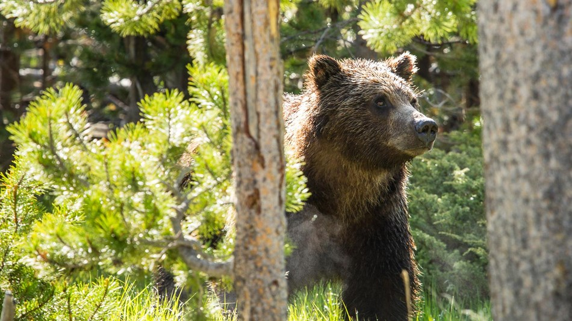

# Sarah S. Bohr: Capstone Project

In the summer of 2017, I had the pleasure of vitising Yellowstone National Park. The only blotch on an otherwise great trip was when I was warned by park rangers - vehemently and repeatedly - not to go hiking in the backcountry with less than three people. Yellowstone is home to the largest concentration of mammals in the lower 48 states, including an estimated 690 grizzly bears. Other large predators that make Yellowstone their home include black bears, Canada lynx, coyotes, mountain lions, wolverines, and wolves.

Unfortunately on this trip it was just my boyfriend and I, so no backcountry hiking for us. No big deal - Yellowstone is gorgeous and astonishing and a lot of fun. But as I was checking out a herd of buffalo (from the safety of my car) a lightbulb went off. What if there was an app that could connect people for the sole purpose of hiking or backpacking together? And not just random people...people with a fitness level and hiking goals similar to your own. And so the idea for [my capstone app] got stuck in the back of my mind.

## The Problem

91% of the people injured by bears in Yellowstone since 1970 were hiking alone or with only one hiking partner. Only 9% of the people injured by bears were in groups of three or more people. Solo travellers who want to hike in bear areas may have a difficult time finding someone who has the same plans and fitness level as they do at the same time.

## The Solution

[App] will make it easy to plan ahead and find people to safely hike with. Taking into account the user\'s desired trail, hike length, fitness level, trip dates, and more, [App] will help to match people with similar plans so that they can coordinate a safe and relaxing hike.

## User Experience

- Jennifer wants to spend the day hiking in Grand Teton National Monument but can\'t find a friend who\'s interested in going with her. She\'s an experienced hiker who is planning a rigorous hike on her favorite trail. She creates a trip profile on [App] and connects with a group that\'s tackling the same trail on the same weekend.

- Mark and David are visiting a national park in a few months and want to go hiking. They fill out a profile on [App] indicating that they'd like to go hiking in the national park, their trip dates, their general fitness level and an approximate number of miles they think they'd like to hike. They connect with another couple who will be in Yellowstone at the same time and coordinate to plan a day hike.

- Sasha has just moved to a mountain community and wants to explore the numerous trails in her area. She fills out a profile on [App] noting her fitness level and when she's usually available. She meets several people in her area whith whom she arranges a day hike.

## Technologies

React, Node, Express, AWS, Cypress, Google Maps API (geocoder), Hiking Project Data API, Facebook API, Python